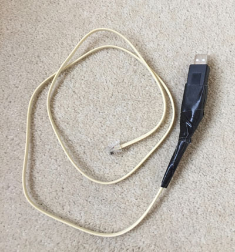

# Controlling Rollease Acmeda blinds from Python & Linux

*My plan is to turn this into a proper utility in due course, probably as a gateway allowing the blinds to be controlled via MQTT.  At this stage, though, these are some experiments and notes.   This requires Python 3.6 or later.*

## Background

The Rollease Acmeda motorised blinds (or 'shades') can be controlled directly with RF-based remote controls, but a hub is also available which connects to wifi and to the 433 MHz radio used by the blinds and the remotes.  It communicates with the outside world, provides timer-based operation, and allows control using the official phone app.  I want to enable some control of the hub using standard network protocols, so  it can be integrated with home automation systems such as [Home Assistant](https://home-assistant.io).

The radio protocol is proprietary and has so far resisted attempts to record and playback its signals. There is also no public API that I am aware of for accessing the hub over the local network. A project in the OpenHab community has been attempting to reverse-engineer the network protocols, but with only partial success.

There is, however, an official way for third-parties to interact with the hub: it has an RS485 serial port, for integration with other building management systems such as Control4.  The protocol is documented [here](https://www.rolleaseacmeda.com/docs/default-source/us/smart-home-integration/serial-protocol/Serial_Protocol_PRGM_GL_v1_3pdf.pdf?sfvrsn=26) and various cabling installation examples can be found at the bottom of [this page](https://www.rolleaseacmeda.com/au/products/product-detail/automate_serial-guide_au).

This code will communicate with the hub over RS485, and listen on the network for commands to be sent to the blinds, and send status reports back. 

## You will need...

### An RS485 adapter

I have successfully tried basic communication under Linux using two different RS485 interfaces:
* The [WINGONEER USB 2.0 to RS485 Serial Converter Adapter](https://www.amazon.co.uk/WINGONEER-Converter-Adapter-SN75176-protection-2/dp/B01N3LM0PU/ref=sr_1_10). These are cheaply available under a variety of other brand names too.
* The [AB Electronics RS485 Pi](https://www.abelectronics.co.uk/p/77/rs485-pi) interface for the Raspberry Pi.  (If you're using this, you should read the instructions on their site about disabling Bluetooth and console serial port usage, and you probably need to set `DEVICE = "/dev/ttyAMA0"`).

These appear as serial devices in Linux, such as `/dev/ttyUSB0` or `/dev/ttyAMA0`.   On a typical Linux system, especially if you have more than one device connected, you may find they start up or are recognised in a different order, so the thing that was `ttyUSB0` today might become `ttyUSB1` on the next reboot. 

So a better way to specify the devices, if it's available, is to use one of the symbolic links under `/dev/serial/by-id/`.  These should automatically point to the right place.  On my system, the Wingoneer USB adapter appears as

    /dev/serial/by-id/usb-Silicon_Labs_CP2104_USB_to_UART_Bridge_Controller_018DF044-if00-port0

It's more verbose, but should be more reliable.   Copy the full pathname and paste it into the code as the DEVICE setting.

**NOTE**: If you get permission errors when accessing the port, you probably need to add yourself to the 'dialout' group, and log out and back in again.

## An RS485 cable

You will need to connect your RS485 adapter to the port on the hub using what is technically a '4p4c connector'.  This is the thing traditionally used to connect phone handsets to their bases, and you should note that it is smaller than an RJ45 ethernet connector or an RJ11 phone socket connector.  I bought a phone handset cable and cut it in half, then connected it to a Wingoneer adapter.  The cable was fairly delicate, so I added plenty of strain-relief!

Yes, I know, it's not pretty, but it does the job well!

When making up RS485 cables, it's worth noting that some manufacturers use letters A & B to describe the two signal lines, and some use '+' and '-', but not always consistently.  You should be safe to swap '+' and '-' if your first attempt doesn't succeed.  Ground, however, is always ground!  I debugged mine by running minicom or miniterm.py to look at the port, e.g.

    miniterm.py --raw /dev/ttyUSB1 9600

and power-cycling the hub.  I got a couple of short lines of text when the connections were the right way around, and gobbledegook when they weren't.

The `test_connection.py` simply sends a request asking the hub to identify itself.  You should get back something like

    b'!626V;'

which would indicate that the ID (or 'address') of your hub is '626'.  (It's possible to connect more than one hub on a single RS485 bus.) 

The motors controlled by a hub also have individual addresses, typically '001', '002' etc.  If you have the phone app (which is called 'Automate' - how many different brands do these guys need?), you can go to the edit screen for one of your blinds and see the same information there:

## Running the software

At present, the main.py script just connects to the hub, finds the motors, asks about their position, and monitors them for changes. 

It depends on some packages in requirements.txt, so the best way to run it is probably in a virtualenv:

    python3 -m venv env
    env/bin/python3 -m pip install -r requirements.txt

and then

    env/bin/python3 main.py

More coming soon.  Contributions welcome!

Quentin Stafford-Fraser - https://quentinsf.com - Aug 2019

